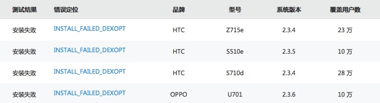
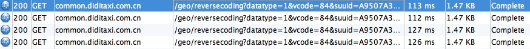
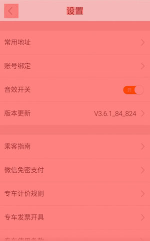

# 嘀嘀打车 V3.6.1_84_824

1. 应用代码方法数太多，达到了62337，[详细](methodCount.md)，随着以后需求的增加，很快就到达dex 65k的限制。达到限制后会出现method ID not in [0, 0xffff]: 65536的异常导致无法编译安装。虽然Google官方推出了Multidex支持库，但依然存在一些问题，无法完美解决。
竞品及其他应用的方法数，快的打车：50521，易到用车：24792，微信：50810，微博：53171。
以滴滴打车目前的业务实现来说，方法数是不应该这么大的，需要降低当前的方法数，以后如果集成大量其他业务，可以使用动态加载插件化的方式。根据具体的方法数分析，占用最多的是protobuffer: 20172，这是使用Google的Protocol buffers生成的，可以改用square的wire，方法数将减少很多。
滴滴打车支持的Android最小版本是Android2.2，但是目前的方法数太多，会导致部分Android2.3，2.2的手机无法安装。Testin测试安装失败的记录：


2. 网络调用的优化。网络调用采用的[volley](https://android.googlesource.com/platform/frameworks/volley)。每次进入嘀嘀打车，到返回附近出租车列表接口之间还有二三十个接口，其中有的是没必要的完全重复的调用。例如，http://common.diditaxi.com.cn/geo/reversecoding?lng=116.3998336987&lat=39.9077323143 根据经纬度返回具体地址，参数经纬度没变，但是调用了多次。

有的数据量较大的接口，例如每次都会调用的http://common.diditaxi.com.cn/config/app 返回数据量14k多，里面包括了已支持的300多城市的信息，可以传递上次更新时间或版本避免全量返回和保存。

3. 图片的优化。http://common.diditaxi.com.cn/config/start?datatype=1&pixels=480*800&networkType=WIFI ，宽度480的手机调用接口返回的广告图片没有做分辨率和网络条件的适配，返回的都是1080x1920的图片，应用代码解析成一个Bitmap对象时所占用的内存是1080x1920x4字节，接近8M


4. 导出apk包时没有使用ProGuard混淆代码。ProGuard通过删除无用代码，将代码中类名、方法名、属性名用晦涩难懂的名称重命名从而达到代码混淆、压缩和优化的功能。 压缩和优化使得编译后apk包更小。 混淆可以保证代码在被反编译后读懂的难度很大，防止逆向工程。保存混淆后生成的mapping.txt，里面是混淆前后代码的对照表，解决异常时可以找到混淆前的源码。

5. 应用的日志明文放在了sd卡的”didi”文件夹，目录获取可以改成Context.getFilesDir()，位于SDCard/Android/data/你的应用的包名/files/，当应用被卸载的时候，里面的内容都会被移除。目前目录中的traceLog.log，里面记录了手机安装的所有应用的名称列表，手机信息，用户经纬度等信息。sd卡的内容可以被用户和其他应用随意查看和修改，所以应该加密或存储在应用的内部存储空间。

6. 通过调试GPU过度绘制，可以看到目前很多页面存在Overdraw(过度绘制)，有些页面的布局layout也不是很合理，浪费了大量的CPU以及GPU资源，当然因为没有复杂的列表和大量动画，目前页面的绘制时间还没达到影响流畅度的16ms。


 
