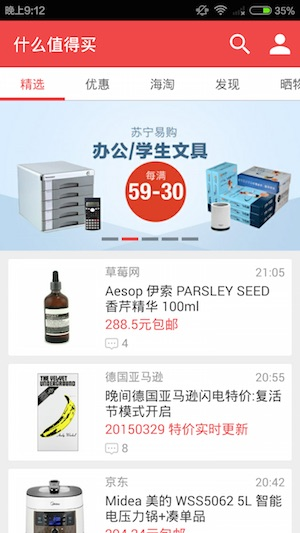
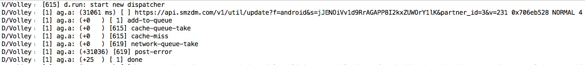

# 什么值得买V5.5.1

1. 应用代码方法数35551 [详细](methodCount.md)

2. 主界面截图：


首页的activity继承的是Google官方android-support-v7包中ActionBarActivity。最早为了在Android3.0以前的版本使用ActionBar，之前应用一般使用的是大名鼎鼎的JakeWharton开源的ActionBarSherlock，现在可以和他说再见了。

3. 栏目滑动切换采用的开源的[PagerSlidingTabStrip](https://github.com/astuetz/PagerSlidingTabStrip)。

在onCreate方法（或者onCreateView对于一个fragment），绑定PagerSlidingTabStrip控件到ViewPager上

```
 // 初始化ViewPager并且添加适配器
 ViewPager pager = (ViewPager) findViewById(R.id.pager);
 pager.setAdapter(new TestAdapter(getSupportFragmentManager()));

 //向ViewPager绑定PagerSlidingTabStrip  
 PagerSlidingTabStrip tabs = (PagerSlidingTabStrip) findViewById(R.id.tabs);
 tabs.setViewPager(pager);
 
```
 
4. 列表采用的是开源的[JazzyListView](https://github.com/twotoasters/JazzyListView)。
主要是为ListView和GridView增加各种动画，[效果展示](http://lab.hakim.se/scroll-effects/)。
通过setTransitionEffect设置各种动画效果，例如list.setTransitionEffect(new SlideInEffect()); 也支持support-v7包中的RecyclerView。


5. 二级页面右划手势返回采用的是开源的[SwipeBack](https://github.com/sockeqwe/SwipeBack)。

6. 消息推送采用自己实现的MQTT，和xmpp的对比，[http://www.zhihu.com/question/20730361](http://www.zhihu.com/question/20730361)。

7. 应用中所有的接口都是https，Charles抓包时右键菜单中选中“Enable SSL Proxying”。网络通信框架使用的Volley，其中日志的开关是VolleyLog.java中的boolean DEBUG = Log.isLoggable("Volley", Log.VERBOSE);，默认是关闭的，可以通知执行“adb shell setprop log.tag.Volley V”临时打开方便调试，如果不想发布的apk中能打开，打包时可以直接设为false。






